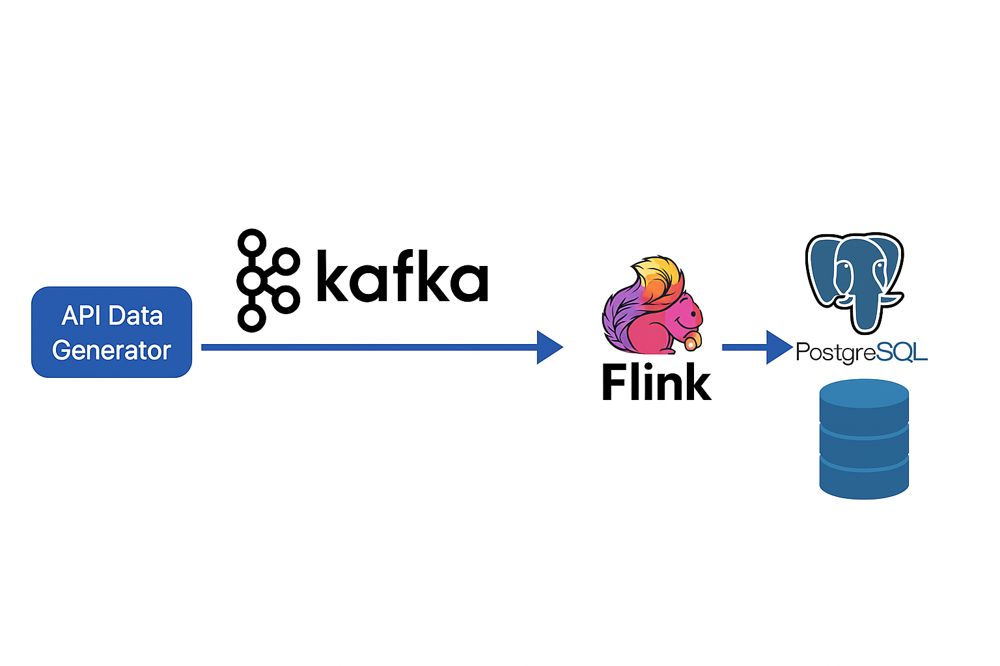
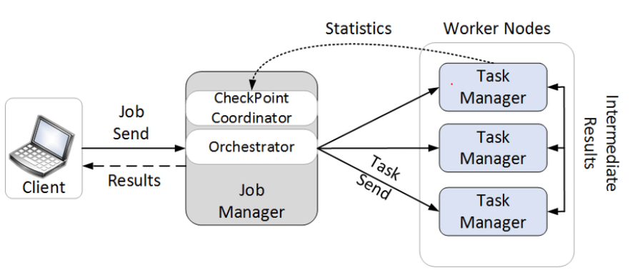

#  
 

#  **Kafka + Flink + PostgreSQL: Data Processing Pipeline**

##  **Introduction**

This document describes the step-by-step process to ingest, process, and store data using **Kafka, Apache Flink, and PostgreSQL**. We will monitor the **processing latency** between Kafka ingestion and PostgreSQL storage.

## 🔍 **The architecture consists of the following key components:**



**Kafka (Broker & Zookeeper)**:
   - Manages message queues for streaming data.

**Flink (JobManager & TaskManager):**



   - Processes streaming data in real-time.
   - Flink is the core data processing engine in this architecture. It is responsible for ingesting, processing, and analyzing the real-time streaming data from Kafka. The system works in a distributed manner with two main components:

	- JobManager: Coordinates the job execution, schedules tasks, and ensures job recovery and fault tolerance. It manages the lifecycle of jobs and handles resource allocation.

	- TaskManager: Executes the actual processing of data. It runs the tasks (such as reading from Kafka, processing the data, and writing results to PostgreSQL) and ensures that the data is processed in parallel for better scalability and throughput.

**PostgreSQL:**
   - Stores processed data for further analysis.


## 🔍 **Why These Scripts?**

We created these scripts to:

1. **Ingest Data into Kafka**  
   - Fetch real-time user data from an API and send it to Kafka.
2. **Process Data with Flink**  
   - Read messages from Kafka, transform them (calculate birth year), and measure processing latency.
3. **Store in PostgreSQL**  
   - Save processed data for further analysis.
4. **Monitor Performance & Latency**  
   - Track the delay between ingestion and database insertion.

---

## 🌐 **Project Files Overview**

| File                     | Description                                          |
| ------------------------ | ---------------------------------------------------- |
| `producer_api.py`       | Sends user data to Kafka.                            |
| `flinkfast_job.py`       | Flink job to process and store data.                 |
| `print_data_postgres.py` | Fetches and displays processed data from PostgreSQL. |

---

##  **Execution Steps**

### **1⃣ Start Kafka Producer**

To send data into Kafka:

```bash
python3 producer6_api.py
```


This script fetches **random user data** and pushes it to Kafka.

### **2⃣ Run Apache Flink Job**


Execute Flink to process incoming Kafka messages:

```bash
docker exec -it jobmanager ./bin/flink run -py /opt/src/job/flinkfast_job.py --pyFiles /opt/src/job -d
```

Flink will:
http://localhost:8081/#/job/running
- Read from Kafka
- Compute **birth year** from age
- Insert processed records into PostgreSQL

### **3⃣ Connect  PostgreSQL CLI:**

To access PostgreSQL database inside the container:

```bash
docker exec -it postgres psql -U postgres -d flink_db
```

### **PostgreSQL: Create Processed Events Table**

```sql
DROP TABLE IF EXISTS processed_events;

CREATE TABLE processed_events (
    --uuid VARCHAR(200) PRIMARY KEY, 
    uuid VARCHAR(200), 
    first_name VARCHAR(200),
    last_name VARCHAR(200),
    country VARCHAR(200),
    age INT,
    birth_year INT,
    kafka_timestamp TIMESTAMP,
    postgres_timestamp TIMESTAMP DEFAULT CURRENT_TIMESTAMP
);
```


### **4⃣ Connect  FlinkSql CLI:**

```bash
docker exec -it jobmanager ./bin/sql-client.sh
```

---

##  **Database & Table Creation Queries**

### **Flink: Create Source Table (Kafka)**

```sql
CREATE TABLE events (
    uuid STRING,
    first_name STRING,
    last_name STRING,
    country STRING,
    age INT,
    kafka_timestamp TIMESTAMP(3) METADATA FROM 'timestamp'
) WITH (
    'connector' = 'kafka',
    'topic' = 'RandomUser',
    'properties.bootstrap.servers' = 'kafka-broker:29092',
    'properties.group.id' = 'flink-group-testfast',
    'scan.startup.mode' = 'earliest-offset',
    'properties.fetch.max.wait.ms' = '500',
    'properties.max.poll.records' = '1000',
    'format' = 'json'
);
```

### **Flink: Create Sink Table (PostgreSQL)**
 docker exec -it jobmanager ./bin/sql-client.sh

```sql
CREATE TABLE processed_events (
    uuid STRING,
    first_name STRING,
    last_name STRING,
    country STRING,
    age INT,
    birth_year INT,
    kafka_timestamp TIMESTAMP(3),
    postgres_timestamp TIMESTAMP(3)
) WITH (
    'connector' = 'jdbc',
    'url' = 'jdbc:postgresql://postgres:5432/flink_db',
    'table-name' = 'processed_events',
    'username' = 'postgres',
    'password' = 'postgres',
    'driver' = 'org.postgresql.Driver',
    'sink.buffer-flush.max-rows' = '100',
    'sink.buffer-flush.interval' = '2s',
    'sink.max-retries' = '5'
);
```

### **Flink: Insert Processed Data**

```sql
INSERT INTO processed_events
SELECT
    CAST(uuid AS STRING),
    first_name,
    last_name,
    country,
    age,
    CAST(YEAR(CURRENT_DATE) - age AS INT) AS birth_year,
    kafka_timestamp,
    CURRENT_TIMESTAMP AS postgres_timestamp
FROM events;
```


### **5⃣ Check Record Counts**

#### **In Flink SQL CLI:**
### **PostgreSQL: Count Records in Tables**

#### **Count Records in Processed Events Table**

```sql
SELECT COUNT(*) FROM processed_events;
```

#### **Count Records in Events Table**

```sql
SELECT COUNT(*) FROM events;
```
```sql
 SELECT * FROM processed_events LIMIT(10);
```


---

##  **Latency Monitoring Query**
To check latency statistics, run:

Example Output:


```sql
WITH latency_stats AS (
    SELECT
        uuid,
        first_name,
        last_name,
        country,
        age,
        birth_year,
        kafka_timestamp,
        postgres_timestamp,
        EXTRACT(EPOCH FROM (postgres_timestamp - kafka_timestamp)) AS latency
    FROM processed_events
),
first_record AS (
    SELECT MIN(kafka_timestamp) AS first_kafka_timestamp
    FROM processed_events
)
SELECT
    CASE
        WHEN latency < 10 THEN 'Under 10'
        WHEN latency BETWEEN 10 AND 20 THEN '10-20s'
        WHEN latency BETWEEN 20 AND 40 THEN '20-40s'
        WHEN latency BETWEEN 40 AND 120 THEN '40-120s'
        WHEN latency BETWEEN 120 AND 300 THEN '120-300s'
        WHEN latency > 300 THEN 'More than 300s'
        ELSE 'No Latency'
    END AS latency_group,
    COUNT(*) AS message_count,
    (SELECT COUNT(*) FROM processed_events) AS total_count,
    EXTRACT(EPOCH FROM (NOW() - (SELECT first_kafka_timestamp FROM first_record))) AS time_since_first_record_seconds
FROM latency_stats
GROUP BY (latency_group)
ORDER BY latency_group;

```

```sql
WITH first_record AS (
    SELECT MIN(kafka_timestamp) AS first_kafka_timestamp
    FROM processed_events
),
total_stats AS (
    SELECT COUNT(*) AS total_count, NOW() - (SELECT first_kafka_timestamp FROM first_record) AS total_time
    FROM processed_events
)
SELECT 
    total_count,
    EXTRACT(MINUTE FROM total_time) AS total_minutes, 
    CASE
        WHEN EXTRACT(MINUTE FROM total_time) = 0 THEN 0   
        ELSE ROUND(total_count / EXTRACT(MINUTE FROM total_time), 2)
    END AS records_per_minute
FROM total_stats;


```
This query helps analyze the processing efficiency between Kafka and PostgreSQL.

---

## **Flink Logs & Debugging**

To check Flink logs for errors:

```bash
docker logs jobmanager | grep ERROR
```

To access Flink SQL CLI:

```bash
docker exec -it jobmanager ./bin/sql-client.sh
```


---

##  **Performance Optimizations**

###  **Faster Kafka Reads**

- Increased `properties.fetch.max.wait.ms` and `properties.max.poll.records`
- Set `scan.startup.mode = 'earliest-offset'`

###  **Faster PostgreSQL Writes**

- Adjusted `sink.buffer-flush.max-rows` and `sink.buffer-flush.interval`
- Increased `sink.max-retries` to handle failures

---

##  **Conclusion**

This pipeline efficiently ingests, processes, and stores streaming data. It allows us to measure processing delays and optimize throughput. If you need improvements, modify the buffer sizes, parallelism, or Kafka poll settings.

If you have any questions or need optimizations, let me know! 🚀
